# Karna_Semi-humanoid_robot

**Karna** is a semi-humanoid robot designed for security and industrial applications. It was developed during my bachelor’s degree as my final-year project.

The system integrates several functional modules, including:

1. An RRR (Revolute–Revolute–Revolute) robotic arm for object manipulation
2. Ultrasonic radar for obstacle detection and environmental sensing
3. Metal detection based on a 555 timer circuit
4. Voice and gesture recognition for human–robot interaction
5. An experimental electromagnetic pulse (EMP) emitter concept intended for research on neutralizing rogue robots or drones
6. An emergency flotation system for operation in water-hazard environments
7. GPS for location tracking and navigation
   
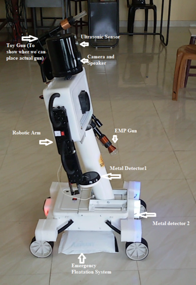

### Block Diagram

This prototype integrates multiple subsystems designed for remote operation, environmental sensing, and assistive robotic tasks. The platform includes a robotic arm that can be wirelessly controlled via Bluetooth for basic object manipulation. A metal detection module mounted on the robotic arm enables the system to detect metallic objects in its immediate surroundings. The system also incorporates a GPS module connected to an IoT platform for location tracking and remote monitoring.

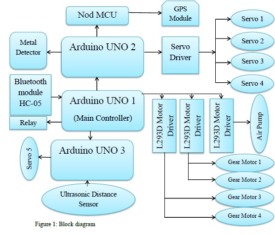

The robot is built on a four-wheel mobile base that houses the battery system, including both the main power supply and an auxiliary power supply. All electronic controllers are located in the chest compartment of the robot, which serves as the central control unit for coordinating sensing, communication, and actuation subsystems. For environmental awareness and safety, the robot includes an ultrasonic sensing module for obstacle detection, with real-time readings displayed on a computer interface. Additionally, an emergency flotation mechanism is implemented to detect the presence of water and automatically activate an air pump to maintain buoyancy.

### An RRR (Revolute–Revolute–Revolute) robotic arm for object manipulation

**Forward Kinematics:**

We assign frames at each joint: the Shoulder ($Joint_1$), the Elbow ($Joint_2$), and the Gripper/Wrist ($Joint_3$). For a planar robot, all $z$-axes point out of the page. 

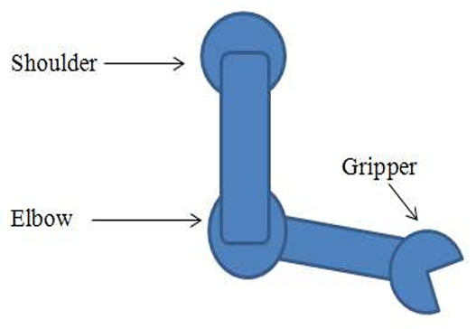

1. Link 1 ($L_1$): Distance between Shoulder and Elbow.
2. Link 2 ($L_2$): Distance between Elbow and Gripper.
3. Link 3 ($L_3$): Distance from the Gripper joint to the tip of the end-effector.
4. $\theta_1, \theta_2, \theta_3$: The joint angles.
   
Position ($x, y$): The coordinates of the end-effector are the sum of the horizontal and vertical components of each link:
* $$x = L_1 \cos(\theta_1) + L_2 \cos(\theta_1 + \theta_2) + L_3 \cos(\theta_1 + \theta_2 + \theta_3)$$
* $$y = L_1 \sin(\theta_1) + L_2 \sin(\theta_1 + \theta_2) + L_3 \sin(\theta_1 + \theta_2 + \theta_3)$$
  
Orientation ($\phi$):The total angle of the end-effector relative to the $x$-axis is simply the sum of the joint angles:
* $$\phi = \theta_1 + \theta_2 + \theta_3$$

**Inverse Kinematics:**
Given a target end-effector position $(x, y)$ and a desired orientation $\phi$, solving for all angles,

1. Wrist Position:
   
   * $$x_2 = x - L_3 \cos(\phi)$$
   * $$y_2 = y - L_3 \sin(\phi)$$

3. Elbow Angle ($\theta_2$):
   Solving for $\theta_2$ Using the Law of Cosines on the triangle formed by $L_1$ and $L_2$

   $$\cos(\theta_2) = \frac{x_2^2 + y_2^2 - L_1^2 - L_2^2}{2 L_1 L_2}$$

   $$\theta_2 = atan2\left(\pm\sqrt{1 - \cos^2(\theta_2)}, \cos(\theta_2)\right)$$
   
4. Shoulder Angle ($\theta_1$):
   
   $$\theta_1 = atan2(y_2, x_2) - atan2(L_2 \sin\theta_2, L_1 + L_2 \cos\theta_2)$$

6. Wrist Angle ($\theta_3$):
   
   $$\theta_3 = \phi - \theta_1 - \theta_2$$

   where $\phi$ is the desired orientation

**Velocity Kinematics:**

To relate joint velocities ($\dot{\theta}$) to end-effector velocities ($\dot{x}, \dot{y}$), we use the Jacobian matrix ($J$):

$$\begin{bmatrix} 
\dot{x} \\ 
\dot{y} \\ 
\dot{\phi} 
\end{bmatrix} = J \begin{bmatrix} 
\dot{\theta}_1 \\ 
\dot{\theta}_2 \\ 
\dot{\theta}_3 
\end{bmatrix}$$

The elements of the Jacobian are the partial derivatives of the position equations:

$$J = \begin{bmatrix} 
\frac{\partial x}{\partial \theta_1} & \frac{\partial x}{\partial \theta_2} & \frac{\partial x}{\partial \theta_3} \\ 
\frac{\partial y}{\partial \theta_1} & \frac{\partial y}{\partial \theta_2} & \frac{\partial y}{\partial \theta_3} \\ 
1 & 1 & 1 
\end{bmatrix}$$

### Ultrasonic radar for obstacle detection and environmental sensing

Obstacle detection is performed using an ultrasonic distance sensor that measures the distance to nearby objects using non-contact acoustic ranging. The sensor emits ultrasonic pulses and calculates the distance to a target based on the time-of-flight of the reflected signal through air.

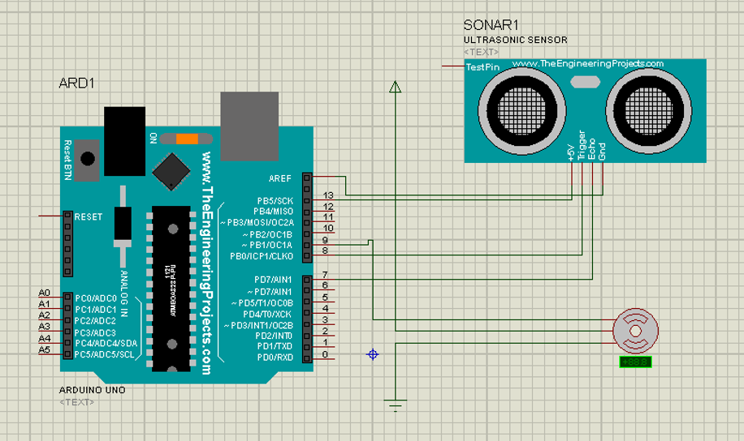

To obtain environmental coverage, the sensor is mounted on a servo motor that sweeps the sensing unit over a 180° field of view in both clockwise and counterclockwise directions. The measured distance data are transmitted to a computer and visualized in real time.

A graphical interface developed using the Processing software environment displays the sensor scan. The current orientation of the sensor is represented by a line indicating the direction of measurement. When no obstacle is detected within the sensing range, the line is displayed in green; when an obstacle is detected, the line changes to red, providing an intuitive visual representation of the environment.

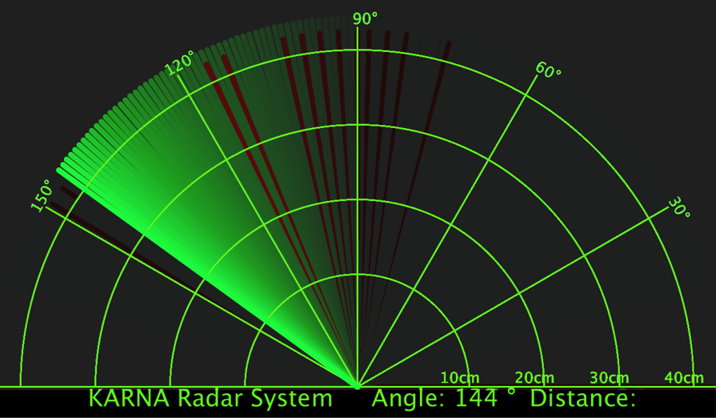

### Metal detection based on a 555 timer circuit

The metal detector employs an NE555 timer-based oscillator to detect metallic proximity through inductive variance. In its quiescent state, the circuit drives a buzzer at a fixed frequency. However, when the search coil encounters a metallic or magnetic material, the change in the magnetic field reduces the coil's inductance. This shift directly modifies the 555 IC’s output frequency, translating the physical presence of metal into a discernible change in the buzzer's pitch.

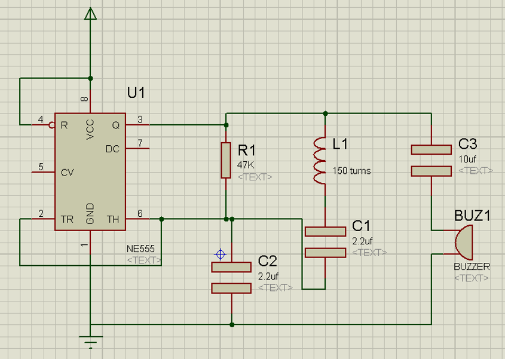

### Global Positioning System (GPS) Integration

The robot incorporates a Global Positioning System (GPS) to provide real-time location tracking and spatial awareness. This system is powered by an ESP32 NodeMCU, utilizing its integrated Wi-Fi capabilities to bridge the gap between hardware sensors and mobile monitoring interfaces.

1. Connectivity and Network Protocol
   The ESP32 manages the data transmission through a multi-step connection process:
   * Network Initialization: The robot establishes a connection to a dedicated hotspot device to ensure stable internet access.
   * Status Monitoring: When the board is connected directly to a PC, the serial monitor provides diagnostic feedback, confirming whether the robot has successfully secured internet access.
   * Server Communication: The system utilizes the BLYNK server as a backend to handle the data stream from the GPS module.

2. Monitoring and Visualization
   For the end-user, the spatial data is visualized through a specialized mobile interface:
   * Application Interface: The operator uses the 'KARNA Monitoring App' to view the robot's status.
   * Real-time Data Display: Once the BLYNK server connection is established, the application displays the robot's precise geographical position and relevant sensor readings directly on the mobile screen.

     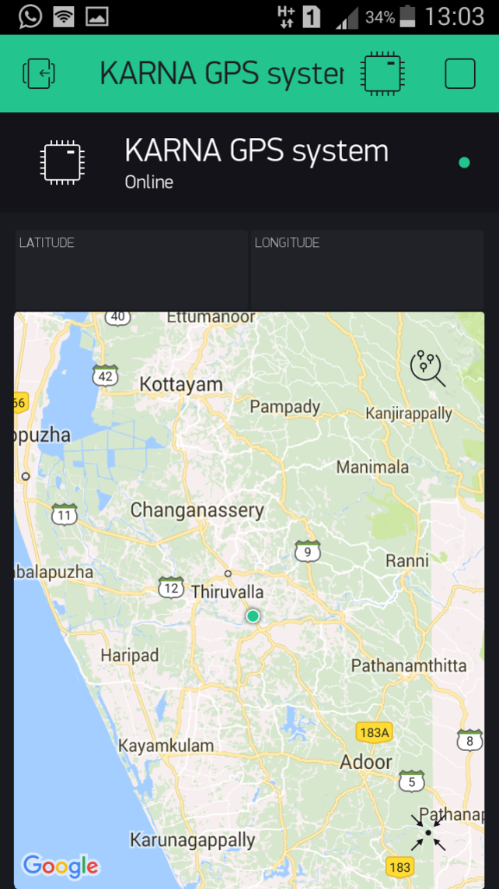

### Human–Robot Interaction: Voice and Gesture Control

For this project, human–robot interaction (HRI) was achieved through two primary modalities: vocal commands and physical gestures, facilitated by the AMR_Voice and AMR:Gestures Android applications. These interfaces allow for intuitive, real-time control of the robot’s mobility and specialized hardware functions.

1. System Setup and Connectivity
   The interaction begins by establishing a wireless link between the mobile device and the robot's control system:Application Initialization: The user opens the Android Meets Robots application suite.Bluetooth Pairing: Connectivity is managed via the "Connect Robot" menu, where the user selects the specific hardware Bluetooth module (MAC address: 00:21:13:04:8C:FC). Operational Readiness: Once the "Connected" status is confirmed, the system is ready to process incoming HRI streams.
   
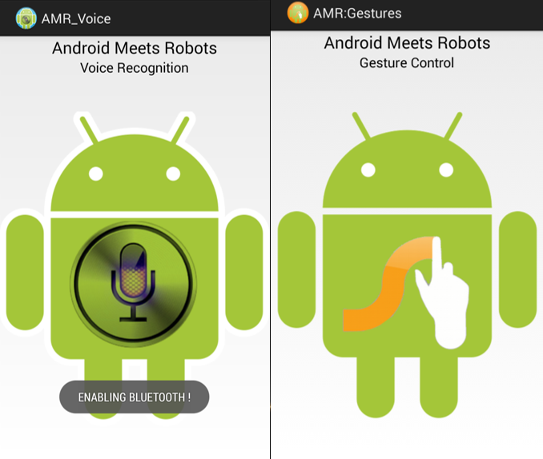
   
2. Voice Recognition Modality
   The voice interface utilizes the smartphone's microphone to capture natural language commands. This allows the operator to control the robot hands-free, which is critical for complex tasks. Key commands include navigational instructions (e.g., "Forward," "Left") and system-specific actions such as "Activate pump".
     
3. Gesture Recognition Modality
   The AMR:Gestures application provides a tactile HRI alternative by mapping specific screen-drawn patterns to robotic actions. Each gesture corresponds to a discrete command sent over the Bluetooth link: Gesture Pattern Resulting Robot Command
   * P-shape Activate pump
   * L-shape Left
   * R-shape Right
   * Line/Stroke Forward or Backward

### Power Supply and Distribution System

The robot’s power architecture is designed to provide stable voltage levels for sensitive electronics while meeting the high current demands of the motors and pumps. To achieve this without a bulky Switch Mode Power Supply (SMPS), the system utilizes two dedicated battery banks (10V and 8V) that feed into three independent internal buses.

1. Bus Architecture
   The power distribution is segregated into three functional buses to minimize electrical noise and ensure system reliability:
   * Bus 1 (8V) – Control & Logic: This bus provides regulated power to the primary controllers (Arduino/ESP32), sensors (GPS/Ultrasound), and relays.
   * Bus 2 (12V) – High-Power Actuators: Dedicated to driving the locomotion and auxiliary systems, including the gear motors, air pump, motor drivers, and high-intensity LED lighting.
   * Bus 3 (12V) – Servo Dynamics: This bus is exclusively reserved for the servo motors. Segregating the servos onto their own bus prevents voltage drops during rapid arm movements from affecting the logic controllers or the locomotion motors.
     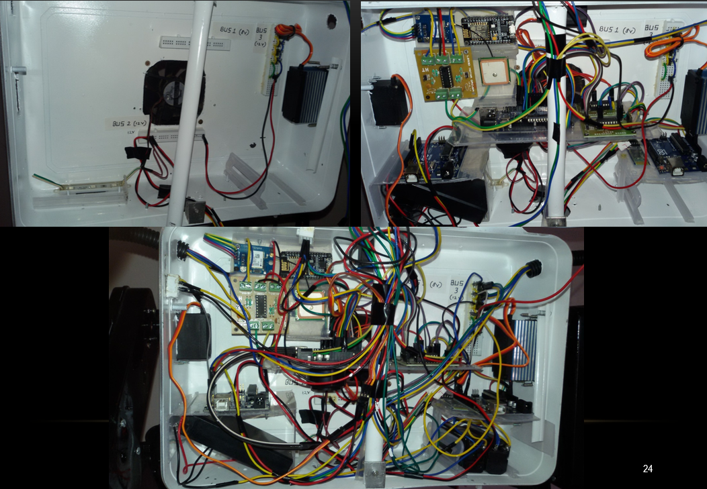

2. Battery Configuration
   The system uses a combination of battery sources to maintain these bus levels:
   * Primary Bank: One 10V battery bank.
   * Secondary Bank: One 8V battery bank.
   These banks are connected to the internal buses via voltage regulators (such as LM7805 or LM7812) or buck/boost converters to step the voltage to the required 8V and 12V outputs.

 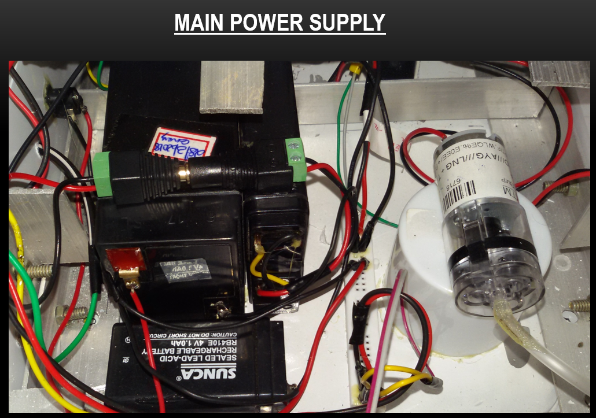
 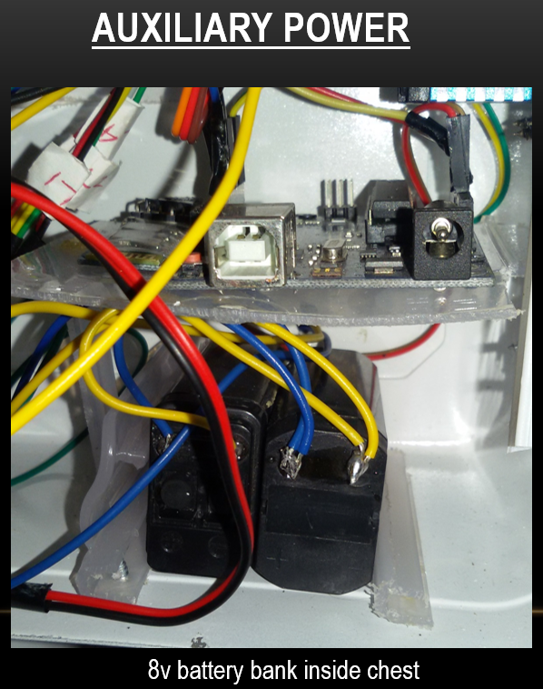

